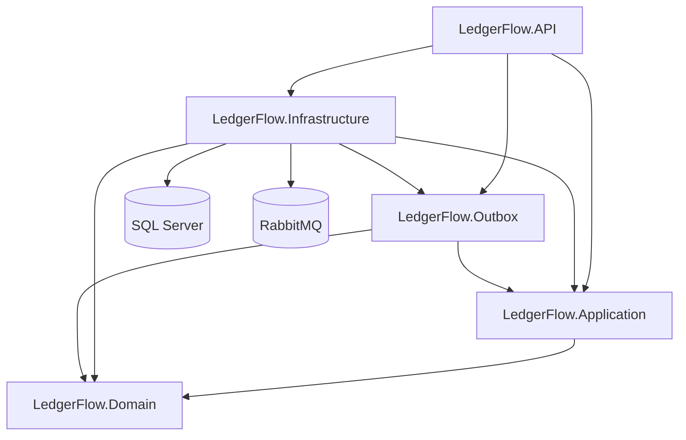
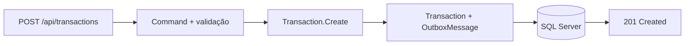
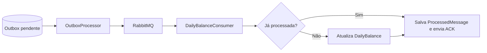
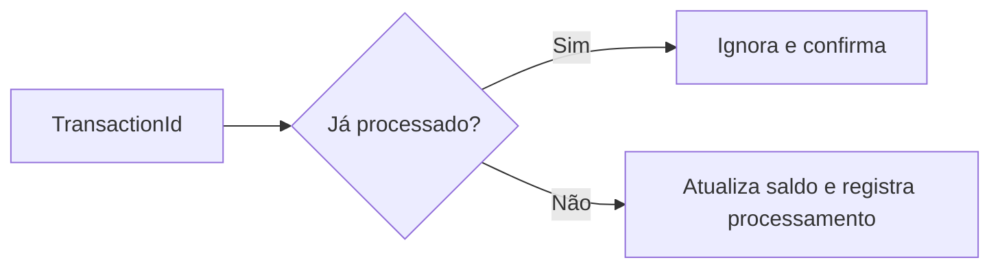
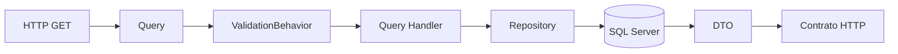
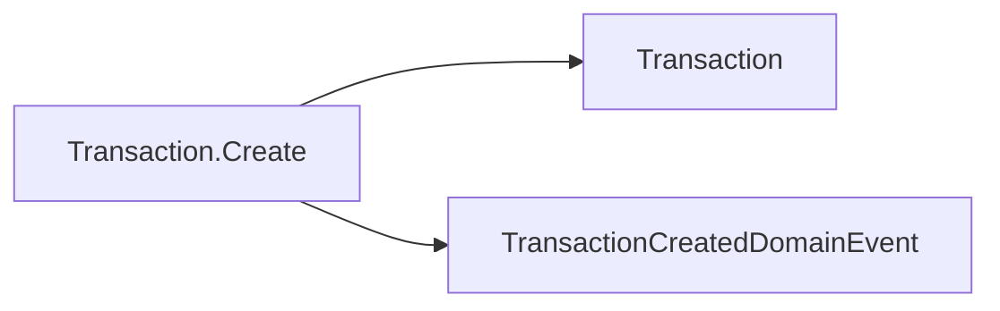
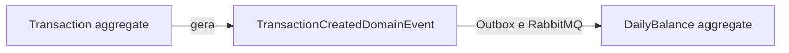

# LedgerFlow

## Definição do escopo

LedgerFlow é uma API para registrar transações de crédito e débito de estabelecimentos e consultar o saldo diário consolidado de cada estabelecimento.

O escopo implementado contempla:

- criação e consulta de transações;
- consolidação diária de créditos, débitos e saldo;
- regras de negócio isoladas no domínio;
- casos de uso com CQRS e MediatR;
- validação centralizada por pipeline;
- persistência em SQL Server com Entity Framework Core;
- gravação atômica de transações e eventos por Transactional Outbox;
- processamento assíncrono dos eventos armazenados no Outbox.

## Sumário

- [Stack](#stack)
- [Arquitetura](#arquitetura)
- [Segurança](#segurança)
- [Domínio](#domínio)
- [Como executar](#como-executar)
- [Banco de dados](#banco-de-dados)
- [Testes](#testes)
- [Observabilidade](#observabilidade)
- [Documentação da API](#documentação-da-api)

## Stack

| Tecnologia | Uso |
| --- | --- |
| .NET 10 | Runtime e SDK |
| ASP.NET Core | API HTTP |
| MediatR 14.2 | Commands, queries, handlers e pipeline behaviors |
| FluentValidation 12.1 | Validação dos casos de uso |
| Entity Framework Core 10.0 | ORM, mapeamentos e migrations |
| SQL Server | Banco de dados relacional |
| RabbitMQ.Client 7.2 | Publicação e consumo assíncrono |
| RabbitMQ 4 | Message broker |
| xUnit | Testes automatizados |
| OpenAPI | Descrição dos endpoints |

## Arquitetura

O projeto segue Clean Architecture, CQRS e separação por caso de uso.

```text
LedgerFlow/
├── src/
│   ├── LedgerFlow.API/
│   │   ├── Contracts/
│   │   ├── Controllers/
│   │   └── Middlewares/
│   ├── LedgerFlow.Application/
│   │   ├── Abstractions/
│   │   ├── Behaviors/
│   │   ├── DailyBalances/
│   │   ├── DTOs/
│   │   └── Transactions/
│   ├── LedgerFlow.Domain/
│   │   ├── Aggregates/
│   │   ├── Enums/
│   │   ├── Events/
│   │   ├── Exceptions/
│   │   └── Repositories/
│   ├── LedgerFlow.Infrastructure/
│   │   ├── Messaging/
│   │   │   └── RabbitMq/
│   │   │       ├── Configuration/
│   │   │       ├── Connection/
│   │   │       ├── Consumers/
│   │   │       ├── Contracts/
│   │   │       ├── Idempotency/
│   │   │       ├── Publishing/
│   │   │       ├── Resilience/
│   │   │       └── Topology/
│   │   └── Persistence/
│   │       ├── Configurations/
│   │       ├── Context/
│   │       ├── Migrations/
│   │       └── Repositories/
│   └── LedgerFlow.Outbox/
│       ├── Abstractions/
│       ├── Messages/
│       ├── Persistence/
│       │   ├── Configurations/
│       │   └── Repositories/
│       └── Processing/
└── tests/
		├── LedgerFlow.IntegrationTests/
		└── LedgerFlow.UnitTests/
```

### Dependências



O Domain não referencia EF Core, SQL Server, ASP.NET Core ou Outbox. Application conhece apenas as abstrações de repositório e unidade de trabalho. Infrastructure implementa persistência. Outbox é um módulo separado e compartilha o mesmo `LedgerFlowDbContext` por meio de `IOutboxDbContext`.

### Decisões arquiteturais

- Commands representam intenção de alteração; Queries representam leitura.
- Handlers apenas orquestram. Regras de negócio permanecem nos aggregates.
- Controllers trabalham com contratos HTTP próprios e não expõem Commands diretamente.
- `ValidationBehavior` executa todos os validators antes do handler.
- Repositórios apenas adicionam ou rastreiam entidades; não executam `SaveChangesAsync`.
- `IUnitOfWork` define o ponto único de commit do caso de uso.
- Configurações do EF Core ficam fora das entidades de domínio.
- Eventos de domínio não conhecem mensageria nem infraestrutura.
- O Outbox está em um class library próprio para explicitar sua responsabilidade.
- Transaction e OutboxMessage usam o mesmo `DbContext` e o mesmo commit.
- `OutboxProcessor` publica por `IOutboxPublisher`; a implementação RabbitMQ fica na Infrastructure.
- O consumer usa `ProcessedMessages` para impedir que o mesmo `TransactionId` atualize o saldo mais de uma vez.
- A confirmação da queue ocorre somente depois do commit de DailyBalance e ProcessedMessage.
- `TransactionType` é persistido e serializado como texto.
- Erros HTTP seguem `application/problem+json`.

### Fluxo de criação



- Uma requisição inválida não chega ao handler.
- `Transaction` e `OutboxMessage` são gravadas no mesmo commit.
- Se o commit falhar, nenhuma das duas é persistida.

### Fluxo do Outbox



- Se o RabbitMQ estiver indisponível, a mensagem continua pendente na Outbox.
- O consumer usa `TransactionId` para impedir processamento duplicado.
- Falhas no consumer seguem a política abaixo:

| Tentativa | Destino | Atraso |
| --- | --- | --- |
| Retry 1 | `daily-balance.retry.1` | 1 segundo |
| Retry 2 | `daily-balance.retry.2` | 5 segundos |
| Retry 3 | `daily-balance.retry.3` | 30 segundos |
| Falha após Retry 3 | `daily-balance.dlq` | Sem novo retry automático |

RabbitMQ trabalha com entrega pelo menos uma vez. A chave única em `ProcessedMessages.MessageId` garante a idempotência.

### Topologia RabbitMQ

| Elemento | Valor |
| --- | --- |
| Mensagem | `TransactionCreated` |
| Exchange | `ledgerflow.transactions` |
| Tipo | `direct` |
| Routing key | `transaction.created` |
| Queue | `daily-balance` |
| Retry queues | `daily-balance.retry.1`, `.2` e `.3` |
| DLQ | `daily-balance.dlq` |
| Confirmação | Publisher confirms e ACK manual |

Payload consumido:

```json
{
	"transactionId": "a5de946f-b72d-4d45-a38f-44616287a17e",
	"merchantId": "a3c5a944-6d77-46ee-9119-52d5f97563cc",
	"type": "Credit",
	"amount": 100.00,
	"occurredAt": "2026-08-14T10:30:00Z"
}
```

Fluxo de idempotência:



`ProcessedMessages.MessageId` é uma chave única e impede que a mesma transação seja aplicada duas vezes.

### Fluxos de consulta



As consultas disponíveis são `GetTransactionQuery` e `GetDailyBalanceQuery`. Resultados inexistentes retornam `404 Not Found`.

### Tratamento de erros

| Exceção | Status HTTP |
| --- | --- |
| `ValidationException` | `400 Bad Request` |
| `DomainException` | `422 Unprocessable Entity` |
| Exceção não tratada | `500 Internal Server Error` |

## Segurança

## Domínio

### Transaction

Aggregate que representa uma movimentação financeira de um estabelecimento.

| Campo | Tipo | Descrição |
| --- | --- | --- |
| `Id` | `Guid` | Identificador único da transação |
| `MerchantId` | `Guid` | Identificador do estabelecimento |
| `Type` | `TransactionType` | Tipo da movimentação: `Credit` ou `Debit` |
| `Amount` | `decimal` | Valor da movimentação, não negativo |
| `OccurredAt` | `DateTime` | Data e hora em que a movimentação ocorreu |
| `Description` | `string` | Descrição obrigatória da movimentação |
| `CreatedAt` | `DateTime` | Data de criação do registro em UTC |
| `DomainEvents` | `IReadOnlyCollection<IDomainEvent>` | Eventos pendentes gerados pelo aggregate; não persistido como coluna |

Regras implementadas:

- `MerchantId` deve ser informado;
- valor não pode ser negativo;
- descrição deve ser informada;
- criação gera `TransactionCreatedDomainEvent`.



### DailyBalance

Aggregate que representa o consolidado financeiro diário de um estabelecimento.

| Campo | Tipo | Descrição |
| --- | --- | --- |
| `Id` | `Guid` | Identificador único do saldo diário |
| `MerchantId` | `Guid` | Identificador do estabelecimento |
| `Date` | `DateOnly` | Data à qual o consolidado pertence |
| `TotalCredits` | `decimal` | Soma das transações de crédito do dia |
| `TotalDebits` | `decimal` | Soma das transações de débito do dia |
| `Balance` | `decimal` | Calculado no domínio: `TotalCredits - TotalDebits` |
| `UpdatedAt` | `DateTime` | Data da última atualização em UTC |

Regras implementadas:

- aceita apenas transações do mesmo estabelecimento;
- aceita apenas transações da mesma data;
- crédito incrementa `TotalCredits`;
- débito incrementa `TotalDebits`;
- `Balance = TotalCredits - TotalDebits`.

### TransactionType

| Valor | Descrição |
| --- | --- |
| `Credit` | Transação de crédito que aumenta `TotalCredits` |
| `Debit` | Transação de débito que aumenta `TotalDebits` |

### TransactionCreatedDomainEvent

Evento de domínio gerado quando `Transaction.Create` conclui com sucesso.

| Campo | Tipo | Descrição |
| --- | --- | --- |
| `TransactionId` | `Guid` | Identificador da transação criada |
| `MerchantId` | `Guid` | Identificador do estabelecimento |
| `Type` | `TransactionType` | Tipo da transação criada |
| `Amount` | `decimal` | Valor da transação criada |
| `OccurredAt` | `DateTime` | Data e hora da movimentação |

```csharp
public sealed record TransactionCreatedDomainEvent(
		Guid TransactionId,
		Guid MerchantId,
		TransactionType Type,
		decimal Amount,
		DateTime OccurredAt) : IDomainEvent;
```

O evento expressa apenas um fato do domínio. A transformação em OutboxMessage ocorre no `LedgerFlowDbContext`, fora do Domain.

### Relação entre aggregates e eventos



## Como executar

### Pré-requisitos

- Docker Desktop com Docker Compose;
- .NET SDK 10 apenas para a execução local da API.

### Configuração opcional

Os dois modos possuem valores locais padrão. Para personalizar portas e credenciais:

```powershell
Copy-Item .\docker\.env.example .\docker\.env
```

O arquivo `docker/.env` não é versionado. As credenciais fornecidas são apenas para desenvolvimento local.

### Rotina 1: API local e dependências no Docker

Este modo executa apenas SQL Server, Adminer e RabbitMQ em containers. A abertura do Visual Studio e a execução da API ficam sob seu controle.

Execute a partir da pasta `LedgerFlow`:

```powershell
.\scripts\run-local.ps1
```

O script:

1. valida se o Docker Desktop está ativo;
2. baixa as imagens ausentes;
3. inicia `docker-compose.dependencies.yml`;
4. aguarda SQL Server e RabbitMQ ficarem saudáveis;
5. termina sem abrir o Visual Studio e sem iniciar a API.

Em seguida:

1. abra `LedgerFlow.sln` normalmente no Visual Studio;
2. confirme `LedgerFlow.API` como startup project;
3. selecione o profile **Visual Studio**;
4. adicione os breakpoints desejados;
5. pressione `F5`;
6. o Swagger será aberto em `http://localhost:5279/swagger`.

O `appsettings.Development.json` já aponta para SQL Server e RabbitMQ locais. Como OutboxProcessor e DailyBalanceConsumer são hosted services da API, breakpoints nesses workers são atingidos pelo mesmo debugger.

Pontos úteis para acompanhar o fluxo completo:

```text
TransactionsController.Create
	-> LoggingBehavior.Handle
	-> ValidationBehavior.Handle
	-> CreateTransactionHandler.Handle
	-> LedgerFlowDbContext.SaveChangesAsync
	-> OutboxProcessor.ProcessMessageAsync
	-> RabbitMqPublisher.PublishAsync
	-> DailyBalanceConsumer.HandleDeliveryAsync
	-> TransactionCreatedDailyBalanceHandler.Handle
```
Endereços:

| Serviço | Endereço |
| --- | --- |
| API | `http://localhost:5279` |
| Health check | `http://localhost:5279/health` |
| Swagger UI | `http://localhost:5279/swagger` |
| OpenAPI JSON | `http://localhost:5279/swagger/v1/swagger.json` |
| SQL Server | `localhost,1433` |
| SQL Server UI (Adminer) | `http://localhost:8081` |
| RabbitMQ AMQP | `localhost:5672` |
| RabbitMQ Management | `http://localhost:15672` |

Para parar as dependências:

```powershell
docker compose -f .\docker\docker-compose.dependencies.yml down
```

```powershell
docker compose -f .\docker\docker-compose.dependencies.yml down --volumes
.\scripts\run-local.ps1
```

### Rotina 2: aplicação completa no Docker

Este modo compila a API pelo Dockerfile multi-stage e inicia API, SQL Server, Adminer e RabbitMQ na mesma rede Docker.

```powershell
.\scripts\run-docker.ps1
```

Equivalente ao comando:

```powershell
docker compose -f .\docker\docker-compose.yml up -d --build --wait
```

Endereços:

| Serviço | Endereço |
| --- | --- |
| API | `http://localhost:8080` |
| Health check | `http://localhost:8080/health` |
| Swagger UI | `http://localhost:8080/swagger` |
| OpenAPI JSON | `http://localhost:8080/swagger/v1/swagger.json` |
| SQL Server | `localhost,1433` |
| SQL Server UI (Adminer) | `http://localhost:8081` |
| RabbitMQ AMQP | `localhost:5672` |
| RabbitMQ Management | `http://localhost:15672` |

Para parar a stack:

```powershell
docker compose -f .\docker\docker-compose.yml down
```

Para remover também os dados persistidos de SQL Server e RabbitMQ:

```powershell
docker compose -f .\docker\docker-compose.yml down --volumes
```

### Acesso às interfaces

#### RabbitMQ Management

- URL: `http://localhost:15672`
- usuário padrão: `ledgerflow`
- senha padrão: `LedgerFlow_Rabbit_2026!`

#### SQL Server no Adminer

- URL: `http://localhost:8081`
- sistema: `MS SQL`
- servidor: `sqlserver`
- usuário: `sa`
- senha padrão: `LedgerFlow_Strong_Password_2026!`
- banco: `LedgerFlow`

Para SSMS ou Azure Data Studio executados no host, use servidor `localhost,1433` com as mesmas credenciais.

### Migrations

Ao iniciar, a API executa automaticamente todas as migrations pendentes antes de iniciar os hosted services do Outbox e RabbitMQ. Se a atualização do schema falhar, a aplicação não sobe com um banco incompatível.

Para aplicar manualmente sem iniciar a API:

```powershell
$env:ASPNETCORE_ENVIRONMENT = "Development"
$env:ConnectionStrings__Database = "Server=localhost,1433;Database=LedgerFlow;User Id=sa;Password=LedgerFlow_Strong_Password_2026!;Encrypt=True;TrustServerCertificate=True"
dotnet ef database update `
	--project .\src\LedgerFlow.Infrastructure\LedgerFlow.Infrastructure.csproj `
	--startup-project .\src\LedgerFlow.API\LedgerFlow.API.csproj `
	--context LedgerFlowDbContext
```

## Banco de dados

A configuração de Development usa SQL Server LocalDB:

```text
Server=(localdb)\mssqllocaldb;Database=LedgerFlow;Trusted_Connection=True;TrustServerCertificate=True
```

Para outros ambientes, forneça `ConnectionStrings__Database` sem alterar o código-fonte.

As configurações RabbitMQ podem ser sobrescritas por variáveis como `RabbitMq__HostName`, `RabbitMq__UserName` e `RabbitMq__Password`.

### Tabelas

#### Transactions

| Coluna | Tipo | Descrição |
| --- | --- | --- |
| `Id` | `uniqueidentifier` | Identificador único da transação |
| `MerchantId` | `uniqueidentifier` | Identificador do estabelecimento proprietário da transação |
| `Type` | `nvarchar(20)` | Tipo da movimentação armazenado como texto: `Credit` ou `Debit` |
| `Amount` | `decimal(18,2)` | Valor financeiro da transação |
| `OccurredAt` | `datetime2` | Data e hora em que a movimentação ocorreu |
| `Description` | `nvarchar(500)` | Descrição da movimentação |
| `CreatedAt` | `datetime2` | Data e hora de criação do registro em UTC |

Índices:

- `PK_Transactions`: chave primária em `(Id)`;
- `IX_Transactions_MerchantId_OccurredAt`: índice em `(MerchantId, OccurredAt)` para consultas por estabelecimento e período.

#### DailyBalances

| Coluna | Tipo | Descrição |
| --- | --- | --- |
| `Id` | `uniqueidentifier` | Identificador único do saldo diário |
| `MerchantId` | `uniqueidentifier` | Identificador do estabelecimento ao qual o saldo pertence |
| `Date` | `date` | Data de referência do consolidado |
| `TotalCredits` | `decimal(18,2)` | Soma dos créditos registrados no dia |
| `TotalDebits` | `decimal(18,2)` | Soma dos débitos registrados no dia |
| `Balance` | `decimal(18,2)` | Saldo calculado: `TotalCredits - TotalDebits` |
| `UpdatedAt` | `datetime2` | Data e hora da última atualização em UTC |

Índices:

- `PK_DailyBalances`: chave primária em `(Id)`;
- `IX_DailyBalances_MerchantId_Date`: índice único em `(MerchantId, Date)`, garantindo um consolidado por estabelecimento e dia.

#### OutboxMessages

| Coluna | Tipo | Descrição |
| --- | --- | --- |
| `Id` | `uniqueidentifier` | Identificador único da mensagem Outbox |
| `Type` | `nvarchar(500)` | Nome CLR completo do evento de domínio |
| `Payload` | `nvarchar(max)` | Evento serializado em JSON |
| `CreatedAt` | `datetime2` | Data e hora de criação da mensagem em UTC |
| `ProcessedAt` | `datetime2 null` | Data e hora da publicação ou `null` enquanto estiver pendente |
| `RetryCount` | `int` | Quantidade de falhas de publicação registradas |
| `TraceParent` | `nvarchar(55) null` | Contexto W3C usado para continuar o trace original |
| `TraceState` | `nvarchar(512) null` | Estado adicional opcional da propagação W3C |

Índices:

- `PK_OutboxMessages`: chave primária em `(Id)`;
- `IX_OutboxMessages_ProcessedAt_RetryCount_CreatedAt`: índice em `(ProcessedAt, RetryCount, CreatedAt)` para localizar mensagens pendentes.

#### ProcessedMessages

| Coluna | Tipo | Descrição |
| --- | --- | --- |
| `MessageId` | `uniqueidentifier` | `TransactionId` processado pelo consumer; funciona como chave de idempotência |
| `ProcessedAt` | `datetime2` | Data e hora de conclusão do processamento em UTC |

Índices:

- `PK_ProcessedMessages`: chave primária e única em `(MessageId)`, impedindo o processamento duplicado da mesma transação.

`DailyBalance` e `ProcessedMessage` são salvos na mesma transação SQL. Se qualquer operação falhar, nenhuma das duas alterações é confirmada e a mensagem retorna para a queue.

### Atomicidade do Outbox

```text
BEGIN TRANSACTION
	INSERT Transactions
	INSERT OutboxMessages
COMMIT
```

O `LedgerFlowDbContext.SaveChangesAsync` coleta eventos dos aggregates rastreados, cria as mensagens e chama uma única vez o `SaveChangesAsync` do EF Core. Os eventos são limpos somente após o sucesso.

As migrations ficam em `src/LedgerFlow.Infrastructure/Persistence/Migrations`.

## Testes

Executar todos os testes:

```powershell
dotnet test
```

Os testes unitários usam xUnit e NSubstitute e estão organizados pela mesma camada e feature do código de produção:

```text
tests/LedgerFlow.UnitTests/
├── API/
│   ├── Contracts/Responses/
│   ├── Controllers/
│   └── Middlewares/
├── Application/
│   ├── Behaviors/
│   ├── DailyBalances/
│   │   ├── EventHandlers/
│   │   └── Queries/GetDailyBalance/
│   └── Transactions/
│       ├── Commands/CreateTransaction/
│       └── Queries/GetTransaction/
├── Domain/
│   └── Aggregates/
├── Outbox/
│   ├── Messages/
│   ├── Persistence/
│   │   ├── Context/
│   │   └── Repositories/
│   └── Processing/
└── Infrastructure/
	└── RabbitMq/
```

NSubstitute é usado nas fronteiras: `ISender`, repositórios, `IUnitOfWork`, logging e escopos de serviços. Regras internas dos aggregates são testadas sem mocks.

Cobertura existente:

- bloqueio de comandos inválidos pelo `ValidationBehavior`;
- encaminhamento de comandos válidos ao próximo passo do pipeline;
- criação automática de OutboxMessage no commit;
- serialização do `TransactionCreatedDomainEvent`;
- limpeza dos eventos após persistência;
- controle de `RetryCount` e `ProcessedAt`.
- serialização do contrato RabbitMQ `TransactionCreated`;
- criação da chave idempotente `ProcessedMessage` baseada em `TransactionId`.

Os testes de Outbox usam o provider InMemory do Entity Framework Core. A suíte unitária possui 50 casos.

### Testes de integração com WebApplicationFactory

`LedgerFlow.IntegrationTests` usa `WebApplicationFactory<Program>` para iniciar a API completa em memória:

```text
HTTP Test Client
	-> Controllers
	-> LoggingBehavior / ValidationBehavior
	-> Commands e Queries
	-> Repositories
	-> EF Core InMemory
	-> Transaction + OutboxMessage
```

O host de teste substitui SQL Server por um banco InMemory isolado e remove hosted workers externos. Os 8 testes integrados cobrem:

- `/health` e documento Swagger;
- criação de transação com resposta `201`;
- persistência de `Transaction` e `OutboxMessage` no mesmo fluxo;
- validação HTTP com mensagem precisa para valor negativo;
- consulta de transação existente e inexistente;
- consulta de saldo diário existente e inexistente.

RabbitMQ, retry e DLQ permanecem em testes unitários determinísticos. Testes com broker real devem usar uma suíte separada com Testcontainers.

## Observabilidade

A aplicação usa OpenTelemetry com exportação para o terminal desde a inicialização. Logs e spans incluem `TraceId`, `SpanId`, serviço, duração, status e erros.

Cobertura atual:

| Etapa | Instrumentação |
| --- | --- |
| Request/response HTTP | ASP.NET Core instrumentation + `RequestTraceMiddleware` |
| Commands e queries | `LoggingBehavior` do MediatR |
| Validação | `ValidationBehavior` com span, quantidade de validators e falhas |
| Handlers | duração, sucesso e exceção pelo pipeline MediatR |
| Banco de dados | Entity Framework Core instrumentation e logs de comandos SQL |
| Domain events | `DomainEventDispatcher` |
| Outbox | span por mensagem, retry e resultado da publicação |
| RabbitMQ publisher | span `Producer`, exchange, routing key e message ID |
| RabbitMQ consumer | span `Consumer`, queue, ACK, retry e DLQ |
| Erros HTTP | status do span e logs do `ExceptionHandlingMiddleware` |

O contexto W3C é propagado pelo fluxo assíncrono:

```text
HTTP traceparent
	-> LoggingBehavior / ValidationBehavior / Handler / EF Core
	-> OutboxMessages.TraceParent + TraceState
	-> OutboxProcessor
	-> headers RabbitMQ traceparent + tracestate
	-> DailyBalanceConsumer / DomainEventDispatcher / EF Core
```

Assim, o mesmo `TraceId` permite acompanhar a requisição original até a atualização assíncrona do saldo diário. Os payloads completos, senhas e connection strings não são registrados.

Para acompanhar localmente:

```powershell
.\scripts\run-local.ps1
```

Os traces e logs estruturados são impressos no mesmo terminal da API. Em Docker:

```powershell
docker compose -f .\docker\docker-compose.yml logs -f api
```

As colunas opcionais `TraceParent` e `TraceState` da tabela `OutboxMessages` preservam a correlação quando o worker processa a mensagem depois que a request HTTP já terminou.

## Documentação da API

O Swagger UI e o documento OpenAPI são disponibilizados nos modos local e Docker:

```text
Local:  http://localhost:5279/swagger
Docker: http://localhost:8080/swagger

OpenAPI JSON: /swagger/v1/swagger.json
```

Enums são recebidos e devolvidos como texto, por exemplo `"Credit"` e `"Debit"`.

Respostas de sucesso e recursos não encontrados usam o envelope genérico:

```json
{
	"success": true,
	"data": {},
	"message": null
}
```

Os campos específicos de cada endpoint ficam dentro de `data`. Erros de validação e regras de negócio continuam seguindo `application/problem+json`.

### Criar transação

```http
POST /api/transactions
Content-Type: application/json
```

```json
{
	"merchantId": "a3c5a944-6d77-46ee-9119-52d5f97563cc",
	"type": "Credit",
	"amount": 150.00,
	"occurredAt": "2026-08-14T10:30:00Z",
	"description": "Sale #123"
}
```

Resposta: `201 Created`.

```json
{
	"success": true,
	"data": {
		"id": "2e35b229-2806-4ec2-a09b-fde26da723cb"
	},
	"message": null
}
```

O header `Location` aponta para o endpoint de consulta da transação.

### Consultar transação

```http
GET /api/transactions/{id}
```

Respostas:

- `200 OK` com a transação;
- `404 Not Found` quando não existir.

### Consultar saldo diário

```http
GET /api/merchants/{merchantId}/daily-balances/{date}
```

Exemplo:

```http
GET /api/merchants/a3c5a944-6d77-46ee-9119-52d5f97563cc/daily-balances/2026-08-14
```

Respostas:

- `200 OK` com créditos, débitos e saldo do dia;
- `404 Not Found` quando não existir.